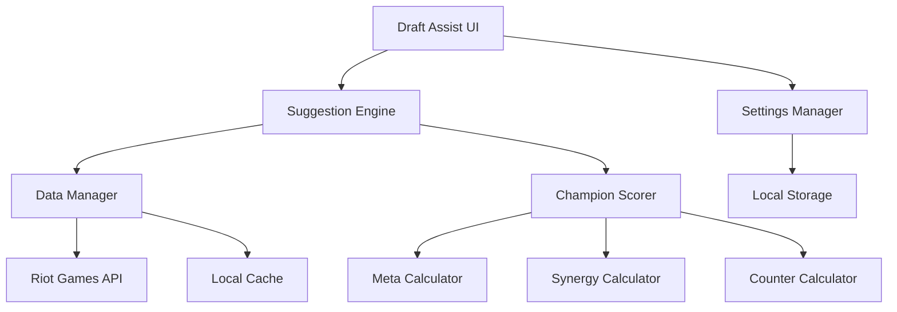
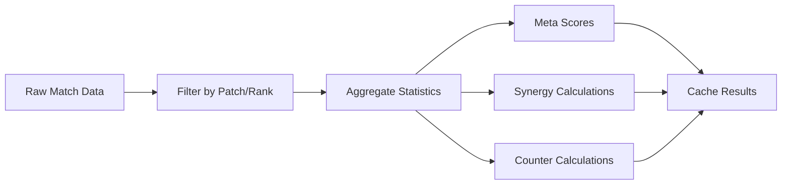

# Design Document: Champion Draft Assist Tool

## Overview

The Champion Draft Assist Tool is a standalone application that provides intelligent champion recommendations for mid lane during League of Legends champion select. The system analyzes current draft state and recommends mid lane champions based on three key factors: current patch strength (meta), team synergy, and enemy matchups. The tool displays two recommendation sections: champions from the user's specified champion pool (with configurable confidence bonus) and overall optimal picks.

The application operates independently of the League of Legends client, requiring manual input of draft state information. This approach ensures compliance with Riot's policies while providing valuable strategic insights to players during champion select.

**MVP Scope**: Single role (mid lane) with core functionality focused on data aggregation, scoring algorithm, and basic UI/CLI interface.

## Architecture

### High-Level Architecture



### Component Responsibilities

- **Draft Assist UI/CLI**: Handles user input for draft state and displays recommendations
- **Suggestion Engine**: Orchestrates the recommendation process and manages business logic
- **Data Manager**: Handles API communication and basic caching
- **Champion Scorer**: Implements the mathematical scoring algorithm
- **Calculator Components**: Specialized components for meta, synergy, and counter calculations

## Components and Interfaces

### Core Interfaces

```typescript
interface DraftState {
  role: "MIDDLE"; // MVP: Fixed to mid lane
  allyChampions: Champion[];
  enemyChampions: Champion[];
  bannedChampions: Champion[];
  patch: string;
}

interface ChampionRecommendation {
  champion: Champion;
  score: number;
  explanations: string[];
  scoreBreakdown: ScoreBreakdown;
}

interface ScoreBreakdown {
  metaScore: number;
  synergyScore: number;
  counterScore: number;
  confidenceBonus?: number;
}

interface Champion {
  id: string;
  name: string;
  role: Role;
  tags: ChampionTag[];
}

enum Role {
  TOP = "TOP",
  JUNGLE = "JUNGLE", 
  MIDDLE = "MIDDLE",
  BOTTOM = "BOTTOM",
  UTILITY = "UTILITY"
}

enum ChampionTag {
  TANK = "Tank",
  FIGHTER = "Fighter", 
  ASSASSIN = "Assassin",
  MAGE = "Mage",
  MARKSMAN = "Marksman",
  SUPPORT = "Support"
}
```

### Data Manager Interface

```typescript
interface DataManager {
  // API Methods
  fetchChampionStats(patch: string, role: Role): Promise<ChampionStats[]>;
  fetchMatchData(filters: MatchFilters): Promise<MatchData[]>;
  
  // Cache Methods
  getCachedData<T>(key: string): T | null;
  setCachedData<T>(key: string, data: T, ttl: number): void;
  
  // Persistence Methods
  saveUserData(userData: UserData): Promise<void>;
  loadUserData(): Promise<UserData>;
}

interface ChampionStats {
  championId: string;
  role: Role;
  winRate: number;
  pickRate: number;
  banRate: number;
  patch: string;
  rankTier: string;
}

interface MatchData {
  matchId: string;
  participants: Participant[];
  gameResult: GameResult;
  patch: string;
}
```

### Suggestion Engine Interface

```typescript
interface SuggestionEngine {
  generateRecommendations(
    draftState: DraftState,
    userChampionPool: string[]
  ): Promise<RecommendationResult>;
}

interface RecommendationResult {
  championPoolRecommendations: ChampionRecommendation[];
  overallRecommendations: ChampionRecommendation[];
  timestamp: Date;
}
```

## Data Models

### Champion Data Model

Champions are represented with static information from Data Dragon and dynamic statistics from match data:

```typescript
interface ChampionData {
  // Static Data (from Data Dragon)
  id: string;
  name: string;
  title: string;
  tags: ChampionTag[];
  
  // Dynamic Statistics (computed from match data)
  roleStats: Map<Role, RoleStatistics>;
}

interface RoleStatistics {
  winRate: number;
  pickRate: number;
  banRate: number;
  averageGameLength: number;
  commonBuildPaths: ItemBuild[];
}
```

### Synergy Data Model

Synergy data is calculated from historical match outcomes:

```typescript
interface SynergyData {
  championPair: [string, string];
  role1: Role;
  role2: Role;
  combinedWinRate: number;
  expectedWinRate: number;
  synergyDelta: number; // combinedWinRate - expectedWinRate
  sampleSize: number;
  patch: string;
}
```

### Counter Data Model

Counter relationships are derived from head-to-head matchup statistics:

```typescript
interface CounterData {
  championA: string;
  championB: string;
  roleA: Role;
  roleB: Role;
  winRateA: number; // championA win rate vs championB
  winRateB: number; // championB win rate vs championA
  sampleSize: number;
  patch: string;
}
```

### User Data Model

```typescript
interface UserData {
  championPool: string[];
  preferences: UserPreferences;
  lastUpdated: Date;
}

interface UserPreferences {
  scoreWeights: ScoreWeights;
  confidenceBonus: number; // default: 15 (configurable)
}

interface ScoreWeights {
  meta: number;    // default: 0.4
  synergy: number; // default: 0.3
  counter: number; // default: 0.3
}
```

## Data Processing Pipeline

### API Data Collection

The system collects data from multiple Riot Games API endpoints:

1. **Static Data (Data Dragon)**:
   - Champion information and metadata
   - Current patch version
   - Champion tags and classifications

2. **Match Data (Match-V5 API)**:
   - Historical match results filtered by patch and rank
   - Champion performance statistics
   - Team composition outcomes

3. **Summoner Data (Summoner-V4 API)** (Optional):
   - User's champion mastery information
   - Rank information for filtering

### Data Aggregation Process



### Synergy Calculation Method

Synergy scores are calculated using win rate deltas:

1. Calculate individual champion win rates for each role
2. Calculate expected combined win rate (statistical independence assumption)
3. Calculate actual combined win rate from match data
4. Synergy delta = actual - expected win rate
5. Normalize to 0-100 scale

```typescript
function calculateSynergyScore(
  championA: string, 
  championB: string,
  matchData: MatchData[]
): number {
  const individualWinRateA = getChampionWinRate(championA, matchData);
  const individualWinRateB = getChampionWinRate(championB, matchData);
  
  const expectedCombinedWinRate = 
    individualWinRateA * individualWinRateB + 
    (1 - individualWinRateA) * (1 - individualWinRateB);
    
  const actualCombinedWinRate = getCombinedWinRate(championA, championB, matchData);
  
  const synergyDelta = actualCombinedWinRate - expectedCombinedWinRate;
  
  return normalizeToScale(synergyDelta, -0.2, 0.2, 0, 100);
}
```

### Counter Calculation Method

Counter scores are based on direct matchup win rates:

```typescript
function calculateCounterScore(
  ourChampion: string,
  enemyChampions: string[],
  matchData: MatchData[]
): number {
  const matchupScores = enemyChampions.map(enemy => {
    const headToHeadWinRate = getHeadToHeadWinRate(ourChampion, enemy, matchData);
    return normalizeToScale(headToHeadWinRate, 0.3, 0.7, 0, 100);
  });
  
  return matchupScores.reduce((sum, score) => sum + score, 0) / matchupScores.length;
}
```

Now I need to use the prework tool to analyze the acceptance criteria before writing the Correctness Properties section.

## Correctness Properties

*A property is a characteristic or behavior that should hold true across all valid executions of a system—essentially, a formal statement about what the system should do. Properties serve as the bridge between human-readable specifications and machine-verifiable correctness guarantees.*

**MVP Scope**: The following properties focus on core functionality for mid lane champion recommendations.

### Property 1: API Data Filtering Consistency
*For any* match data collection request with patch and mid lane filters, all returned matches should satisfy the specified filter criteria
**Validates: Requirements 1.2**

### Property 2: Synergy Score Calculation Accuracy  
*For any* pair of mid lane champions with sufficient match data, the synergy score should equal the normalized difference between actual combined win rate and expected combined win rate (duo delta method)
**Validates: Requirements 1.3, 4.1, 8.3**

### Property 3: Counter Score Calculation Accuracy
*For any* mid lane champion against enemy mid lane champions with matchup data, the counter score should equal the normalized head-to-head win rate
**Validates: Requirements 1.4, 5.1, 8.4**

### Property 4: Banned Champion Exclusion
*For any* list of banned champions and any suggestion generation, no banned champion should appear in either recommendation section
**Validates: Requirements 3.3**

### Property 5: Weighted Score Calculation
*For any* mid lane champion with meta, synergy, and counter component scores, the final score should equal (Meta × 0.4) + (Synergy × 0.3) + (Counter × 0.3)
**Validates: Requirements 8.1**

### Property 6: Configurable Confidence Bonus Application
*For any* champion in the user's champion pool, the final score should be increased by the configured confidence bonus amount (default: 15 points)
**Validates: Requirements 2.3, 8.5**

### Property 7: Explanation Generation Determinism
*For any* recommendation with score components, explanations should be generated based on the highest contributing score components using deterministic rules
**Validates: Requirements 9.1, 9.2, 9.3, 9.4, 9.5, 9.6**

**Deferred Properties** (for future versions):
- Real-time update propagation
- Data persistence round-trip
- Advanced cache timestamp management
- Multi-role support
- Complex team composition analysis

## Error Handling

### API Error Handling

The system must gracefully handle various API failure scenarios:

1. **Network Connectivity Issues**:
   - Implement exponential backoff retry logic
   - Fall back to cached data when available
   - Display appropriate user messages for extended outages

2. **Rate Limiting**:
   - Respect Riot Games API rate limits
   - Implement request queuing and throttling
   - Cache aggressively to minimize API calls

3. **Invalid API Responses**:
   - Validate all API response schemas
   - Handle partial data gracefully
   - Log errors for debugging while maintaining user experience

### Data Validation Errors

1. **Invalid Champion Input**:
   - Validate champion names against current champion roster
   - Provide suggestions for misspelled champion names
   - Reject champions not available for specified roles

2. **Invalid Draft State**:
   - Enforce game rules (max 5 champions per team, no duplicates)
   - Validate pick order constraints
   - Handle edge cases like champion reworks or disabled champions

### Calculation Errors

1. **Insufficient Data**:
   - Require minimum sample sizes for statistical calculations
   - Fall back to general archetype advantages when specific data unavailable
   - Clearly indicate confidence levels in recommendations

2. **Score Calculation Failures**:
   - Handle division by zero in normalization
   - Provide default scores when calculations fail
   - Log calculation errors for debugging

## Testing Strategy

### MVP Testing Focus

The testing strategy focuses on core functionality for mid lane recommendations:

**Unit Tests** focus on:
- Mid lane champion data processing
- Scoring algorithm correctness
- Basic input validation
- CLI/UI component behavior

**Property-Based Tests** focus on:
- Mathematical correctness of scoring algorithms (7 core properties)
- Data filtering and calculation accuracy
- Banned champion exclusion logic

### Property-Based Testing Configuration

- **Testing Framework**: fast-check (JavaScript/TypeScript) 
- **Test Iterations**: Minimum 100 iterations per property test
- **Test Tagging**: Each property test tagged with format: **Feature: champion-draft-assist-tool, Property {number}: {property_text}**
- **Generator Strategy**: Smart generators focused on mid lane champion pool and valid draft states

### MVP Test Data Strategy

1. **Mock API Responses**: Realistic mid lane match data and champion statistics
2. **Champion Data Fixtures**: Current mid lane champion roster and metadata
3. **Simplified Match Simulation**: Basic win/loss outcomes for duo and head-to-head calculations
4. **Core Edge Cases**: Banned champions, insufficient data, extreme scores

### Implementation Priorities

**Phase 1**: Data aggregation and basic scoring
**Phase 2**: CLI interface for manual testing  
**Phase 3**: Simple UI for user interaction
**Phase 4**: Property-based test suite

The MVP testing strategy ensures mathematical correctness while keeping scope manageable for initial implementation.